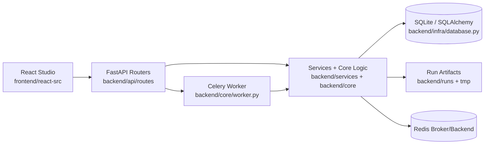
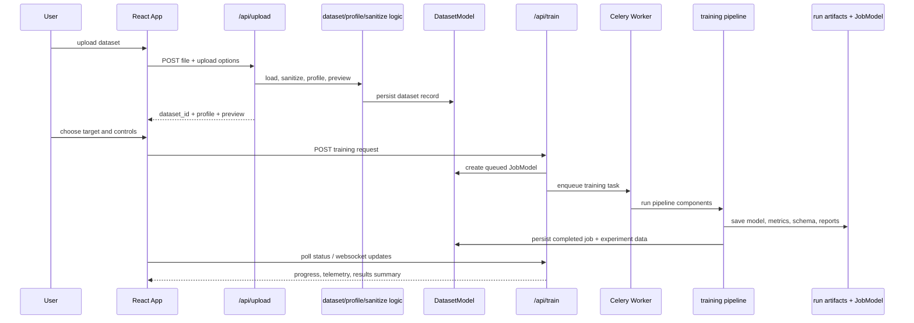
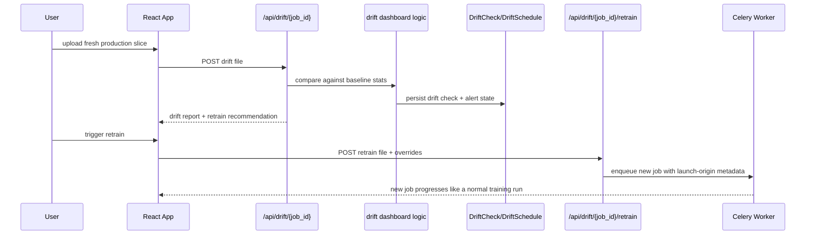
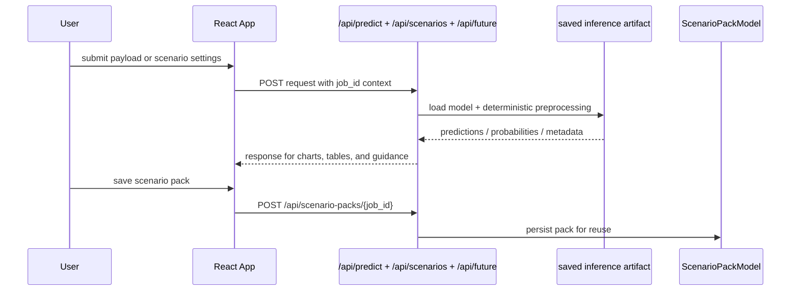

# CODIN Project Logic

This file explains the logic behind the major features in Inferyx and how the frontend, API, services, persistence layer, and artifacts work together.

## System Shape

CODIN has one primary product path:

1. React studio in `frontend/react-src/`
2. FastAPI routes in `backend/api/routes/`
3. service and pipeline logic in `backend/services/` and `backend/core/`
4. persistence in `backend/infra/database.py` and `backend/infra/storage.py`
5. long-running training execution through Celery in `backend/core/worker.py`

The React app is stateful and orchestration-heavy. `frontend/react-src/App.jsx` acts as the control plane for shared studio state, route switching, polling, API calls, and page-to-page context reuse.

## Application Wiring

### Backend entrypoint

`backend/main.py` is the backend composition root.

It is responsible for:

- creating the FastAPI app
- applying CORS policy from `AUTOML_ALLOWED_ORIGINS`
- mounting all route families
- exposing `/health`
- serving the built React bundle from `frontend/static/`
- falling back unknown non-API routes to `index.html` for SPA navigation

Mounted router families:

- datasets
- training
- experiments
- explainability
- predict
- drift
- reports
- misc

### Frontend entrypoint

`frontend/react-src/main.jsx` mounts `App`.

`frontend/react-src/App.jsx` then owns:

- global dataset/job/form state
- route switching inside the SPA
- data refresh polling
- job-context loading
- action handlers for upload, train, predict, drift, export, synthetic, and scenario flows

That design means the page modules are mostly presentation and page-local orchestration, while `App.jsx` is the studio-wide command layer.

## High-Level Architecture Diagram



## Primary Runtime Sequences

### Dataset upload to training completion



### Drift check to retrain recommendation



### Online prediction and scenario analysis



## Runtime Logic

### Local Linux/macOS

- `run.sh` is the supported workstation launcher.
- It prepares `venv/`, installs dependencies on first run, builds the frontend bundle, ensures Redis is available, then starts Celery and FastAPI.
- If `CODIN_RUN_QUALITY=1`, it runs the repo quality gate before bringing up services.

### Local Windows

- `run_windows.bat` is the supported Windows launcher.
- It mirrors the local flow: Python env, frontend dependencies, frontend build or quality gate, then backend and worker startup.
- `start_windows.bat` is now only a compatibility wrapper so the Windows path stays single-sourced.

### Container/Deployed

- `Dockerfile` builds the React bundle into the image.
- `start.sh` is the supported container launcher.
- It starts Redis, FastAPI, Celery, and Nginx.
- It does not rebuild the frontend on every boot unless `CODIN_BUILD_FRONTEND_ON_START=1`.

## Core Data Model Logic

The SQLAlchemy models in `backend/infra/database.py` anchor most project features:

- `DatasetModel`: uploaded, imported, repaired, merged, OCR-reviewed, synthetic, or retrained dataset records
- `JobModel`: training runs, status, metrics, config, output references, and serving metadata
- `ExperimentRun`: run comparison and experiment tracking records
- `WorkspaceModel`: resumable workspace context
- `NotificationModel`: studio notices surfaced in tracking/workspace flows
- `DriftCheck` and `DriftSchedule`: monitoring history and recurring drift policy
- `TeamNote`: notes attached to runs or entities
- `ScenarioPackModel`: saved scenario bundles for what-if workflows
- `MetaLearningRecord`: cross-dataset memory for recommendations and meta insights

Artifact files live under run storage paths resolved by `backend/infra/storage.py`. The database stores metadata and pointers; the filesystem stores heavier assets such as models, metrics, schemas, reports, and explainability outputs.

## Feature Logic By Studio Surface

### Overview

Frontend logic:

- `OverviewPage.jsx` is the intake and launch surface.
- It handles upload mode vs connector mode, target/task hints, training readiness, and OCR review handoff.

Backend logic:

- `backend/api/routes/datasets.py`
  - `/upload`: ingest file-based datasets
  - `/import-source`: ingest connector-based datasets
  - `/dataset/{dataset_id}/ocr-review`: turn reviewed OCR text into a dataset
  - `/detect`: infer likely task type and target hints
- `backend/services/profiling_service.py`: task-type heuristics and warnings
- `backend/services/studio_service.py`: workspace snapshots and lineage helpers
- `backend/api/routes/training.py`
  - `/train/forecast`: estimate likely runtime/behavior
  - `/train/model-registry`: preview model groups and strategy fit

What the feature is doing logically:

- Accept raw or connector-based input
- Normalize into a canonical dataset record
- Immediately derive preview rows, ingest summary, and dataset metadata
- Infer likely ML task and surface warnings before the user commits to training
- Keep enough context in the workspace to resume later

### Data

Frontend logic:

- `DataPage.jsx` is the inspection and mutation surface for datasets before training.

Backend logic:

- `backend/api/routes/datasets.py`
  - `/dataset/{dataset_id}`: dataset profile/info
  - `/health/{dataset_id}`: health score
  - `/leakage/{dataset_id}`: leakage report
  - `/repair-preview` and `/repair-apply`: clean/repair simulation and materialization
  - `/merge-studio` and `/merge-studio/preview`: join datasets
  - `/dataset/{dataset_id}/timeline`: dataset evolution
  - `/dataset/{dataset_id}/lineage-graph`: lineage relationships
  - `/dataset/{dataset_id}/versions`: version comparison
- `backend/services/data_sanitizer.py`: deterministic cleaning pipeline and version reporting
- `backend/services/leakage_service.py`: suspicious target leakage detection
- `backend/services/studio_service.py`: lineage graph, timeline, version comparison
- `backend/core/health_score.py`: data quality scoring

What the feature is doing logically:

- Turn raw uploaded data into a quality-assessed training candidate
- Identify brokenness before model training starts
- Preserve provenance when the user repairs, merges, or branches datasets
- Expose enough metadata for trust and auditability, not just raw rows

### Training

Frontend logic:

- `TrainingPage.jsx` is the active run and preflight surface.
- `App.jsx` holds the training form state and continuously polls job status.

Backend logic:

- `backend/api/routes/training.py`
  - `/train`: enqueue a new training job
  - `/status/{job_id}`: fetch run status and output summary
  - `/jobs`: list job history
  - `/leaderboard`: summarize global performance
  - `/ws/status/{job_id}`: live status updates
- `backend/core/worker.py`: Celery worker entry for training jobs
- `backend/services/training/components.py`: pipeline-step orchestration
- `backend/core/pipeline_engine.py`: structured pipeline execution model
- `backend/services/training/trainer.py`: lower-level model training/evaluation logic
- `backend/services/training/model_selector.py`: choose candidate models and tuning budgets
- `backend/services/training/evaluator.py`: task detection, diagnostics, controls normalization
- `backend/services/training/forecasting.py`: training forecast and advisory logic
- `backend/services/training/preprocessing.py`: clipping, skew handling, PCA, and transform utilities
- `backend/services/training/inference.py`: saved inference artifact logic

What the feature is doing logically:

- Validate target choice and controls
- Sanitize and profile the dataset
- Select a model pool based on task, size, and goal
- Train/tune the candidate space
- Persist the winning artifact together with deterministic inference-time preprocessing
- Emit status, reasoning, telemetry, and final outputs back to the studio

### Results

Frontend logic:

- `ResultsPage.jsx` is the post-training interpretation and artifact surface.
- It reads the active job status plus explainability/report endpoints.

Backend logic:

- `backend/api/routes/explain.py`
  - SHAP summary
  - permutation importance
  - local explanation
  - pipeline graph
  - feature lineage
  - calibration
  - threshold tuning
  - counterfactual
  - trust heatmap
- `backend/api/routes/reports.py`
  - PDF report
  - model card
- `backend/services/explain_service.py`: explanation, calibration, threshold, counterfactual, lineage helpers
- `backend/services/report_service.py`: report generation
- `backend/core/debugger.py`: pipeline graph generation
- `backend/core/recommendations.py`: recommendation cards
- `backend/core/insights.py`: story/narration generation

What the feature is doing logically:

- Translate a finished run into operational and analytical understanding
- Separate “what won” from “why it won” and “how safe it is to use”
- Provide exportable artifacts for stakeholders and downstream deployment

### Tracking

Frontend logic:

- `TrackingPage.jsx` is the experiment, workspace, notes, and dataset history surface.

Backend logic:

- `backend/api/routes/experiments.py`
  - `/experiments`
  - `/experiments/compare`
  - `/experiments/diff`
  - `/experiments/{run_id}`
  - `/notes/...`
  - `/workspaces`
  - `/workspaces/resume`
  - `/notifications`
- `backend/services/studio_service.py`: workspace snapshot and version comparison helpers
- `backend/infra/launch_origin.py`: labels the origin of a run, especially for drift-driven reopen flows

What the feature is doing logically:

- Preserve historical context around runs and datasets
- Let users compare experiments without retraining them
- Let teams annotate work and recover a previous workspace state
- Distinguish ordinary manual runs from drift-triggered retrain flows

### Monitoring

Frontend logic:

- `MonitoringPage.jsx` is the operate-after-training surface.
- It mixes drift review, live prediction, scenario context, retraining triggers, and goal seeking.

Backend logic:

- `backend/api/routes/drift.py`
  - drift upload/check
  - drift history
  - feature timeline
  - schedule read/write
  - retrain on drift data
- `backend/api/routes/predict.py`
  - scenario context
  - single prediction
  - counterfactual-lite and counterfactual
  - scenarios
  - scenario packs
  - future prediction
  - contract check
  - batch prediction
- `backend/services/drift_service.py`: drift dashboards and scoring
- `backend/core/drift_detector.py`: PSI/KS-style drift computations
- `backend/services/training/inference.py`: deployable deterministic inference artifacts

What the feature is doing logically:

- Compare live or recent data against the training baseline
- Convert drift signals into concrete retraining decisions
- Support pre-production and operational prediction workflows using the same saved artifact
- Make “what if” and “what next” analysis part of ongoing model operations

### Tools

Frontend logic:

- `ToolsPage.jsx` is the advanced utility surface for synthetic expansion, quicktrain, NL helpers, ensembles, and batch utilities.

Backend logic:

- `backend/api/routes/misc.py`
  - `/chat`
  - `/nl/intent`
  - `/recommend/{job_id}`
  - `/export/{job_id}`
  - `/synthetic/{dataset_id}`
  - `/synthetic/judge/{dataset_id}`
  - `/quicktrain`
  - `/zeroshot/{dataset_id}`
  - `/meta/insights/{dataset_id}`
  - `/meta/status`
  - `/narrate/{job_id}`
- `backend/api/routes/training.py`
  - `/ensemble`
- `backend/core/synthetic.py`: synthetic record generation
- `backend/services/ensemble_service.py`: prefit ensemble construction
- `backend/core/playground.py`: quicktrain helpers
- `backend/core/meta_learning.py`: cross-dataset insights and memory
- `backend/core/insights.py`: NL prompt interpretation and narrative generation

What the feature is doing logically:

- Give the user non-core but high-leverage operators around datasets and trained models
- Reuse existing artifacts whenever possible instead of retraining from scratch
- Turn historical learning and natural-language prompting into actionable model work

## Dataset Ingestion Logic

The dataset ingestion path lives mostly in `backend/api/routes/datasets.py`.

High-level logic:

1. Accept file upload or connector request
2. Stream the payload to a temporary or run-scoped path
3. Load into a DataFrame through shared loader utilities
4. Normalize the frame and preview rows
5. Persist a dataset record plus CSV/materialized representation
6. Return preview, ingest summary, and identifiers to the frontend

Important behavior:

- ZIP uploads can restore bundles and prior job context
- OCR-reviewed text can become a structured dataset branch
- dataset lineage is preserved for repaired, merged, synthetic, and retrained descendants

## Frontend State and Page Ownership

The active React app splits responsibilities like this:

- `App.jsx`
  - studio-wide state
  - API handlers
  - polling and route control
  - wiring props into each page
- `components/ui.jsx`
  - reusable visual primitives like panels, tables, charts, controls, and status surfaces
- `components/Layout.jsx`
  - shell, navigation, and top-level page framing
- page modules
  - feature-specific rendering and local derived data

Current page ownership:

- `OverviewPage.jsx`: intake, import mode, training readiness
- `DataPage.jsx`: profile, repair, merge, lineage, leakage
- `TrainingPage.jsx`: live job pulse, forecast, registry preview
- `ResultsPage.jsx`: metrics, explainability, reports, artifact review
- `TrackingPage.jsx`: runs, notes, diffs, workspaces, history
- `MonitoringPage.jsx`: drift, schedules, retrain triggers, operational prediction context
- `ToolsPage.jsx`: ensembles, synthetic data, quicktrain, batch tools, NL helpers

## API Contract Map

This section is intentionally practical rather than exhaustive. It captures the main request/response shapes that a developer needs to reason about feature flows.

### Datasets routes

| Endpoint | Purpose | Request shape | Response shape |
| --- | --- | --- | --- |
| `POST /api/upload` | upload dataset file | multipart file + `pdf_mode` form field | `dataset_id`, `profile`, `preview_records`, `ingest_summary`, optional `imported_job_id` |
| `POST /api/import-source` | import from connector | `{source_type, connection_uri, query}` | same core dataset response as upload |
| `POST /api/dataset/{dataset_id}/ocr-review` | convert OCR review into dataset | `{text}` | new dataset response with preview |
| `POST /api/repair-preview` | preview cleaning effect | `{dataset_id, target_column}` | before/after cleaning summary |
| `POST /api/repair-apply` | materialize repaired dataset | `{dataset_id, target_column}` | `dataset_id` for new repaired branch |
| `POST /api/merge-studio` | merge datasets | `{left_dataset_id, right_dataset_id, join_key_left, join_key_right, join_type}` | merged dataset info |
| `POST /api/merge-studio/preview` | preview join results | same merge payload | merge preview rows + stats |
| `GET /api/datasets` | list datasets | query: `limit`, `include_archived` | dataset list |
| `GET /api/dataset/{dataset_id}` | fetch one dataset profile | path only | profile + metadata |
| `GET /api/health/{dataset_id}` | health score | path only | health scoring payload |
| `POST /api/detect` | infer task type | `{dataset_id, target_column?}` | task guess, warnings, column scores |
| `GET /api/leakage/{dataset_id}` | leakage report | optional `target_column` query | leakage findings |
| `GET /api/dataset/{dataset_id}/timeline` | dataset history | path only | timeline entries |
| `GET /api/dataset/{dataset_id}/lineage-graph` | dataset lineage graph | path only | graph nodes/edges |
| `GET /api/dataset/{dataset_id}/versions` | version comparison | optional `target_column` query | version diff report |

### Training routes

#### `POST /api/train`

Request model: `TrainRequest`

```json
{
  "dataset_id": "string",
  "target_column": "string",
  "goal": "Balanced|Performance|Fast",
  "mode": "Balanced|Full|Quick",
  "task_type": "string",
  "preset_name": "string",
  "workspace_id": "string",
  "workspace_name": "string",
  "eval_metric": "string",
  "selected_features": [],
  "handle_imbalance": false,
  "auto_clean": true,
  "cv_folds": 0,
  "pca_mode": "auto",
  "pca_components": 0,
  "export_model": true,
  "export_code": true,
  "export_report": true
}
```

Typical response:

```json
{
  "job_id": "string",
  "status": "queued|training",
  "dataset_id": "string"
}
```

Other high-value training endpoints:

| Endpoint | Purpose | Request shape | Response shape |
| --- | --- | --- | --- |
| `POST /api/train/forecast` | preflight runtime and risk forecast | same core controls as training, lighter payload | forecast text, timing, warnings |
| `POST /api/train/model-registry` | preview selected model families | dataset + target + control hints | task type, selected models, rules, advisory |
| `GET /api/status/{job_id}` | get job status | path only | job state, history, results, config |
| `GET /api/jobs` | list jobs | no body | recent jobs list |
| `GET /api/leaderboard` | global leaderboard | no body | leaderboard rows |
| `WS /api/ws/status/{job_id}` | live status stream | websocket | incremental job updates |
| `POST /api/ensemble` | build prefit ensemble | `{job_ids, strategy, is_classification?}` style payload | ensemble summary + metrics |

### Predict and scenario routes

| Endpoint | Purpose | Request shape | Response shape |
| --- | --- | --- | --- |
| `GET /api/scenario/context/{job_id}` | load feature ranges and context | path only | baseline payload, feature ranges, metadata |
| `POST /api/predict/{job_id}` | single prediction | `{features}` | prediction, confidence, probabilities, sensitivity |
| `POST /api/counterfactual-lite/{job_id}` | quick recourse | `{features, target_prediction?}` | small counterfactual search result |
| `POST /api/counterfactual/{job_id}` | full recourse | same family as above | richer counterfactual report |
| `POST /api/scenarios/{job_id}` | multi-scenario simulation | payload + scenario adjustments + policy | scenario outputs, deltas, guardrails |
| `GET /api/scenario-packs/{job_id}` | list saved packs | path only | saved packs |
| `POST /api/scenario-packs/{job_id}` | save scenario pack | named pack payload | persisted pack summary |
| `POST /api/future` | sweep a feature into future values | `{job_id, payload, feature, values}` style payload | prediction series |
| `POST /api/contract-check/{job_id}` | validate incoming file against schema | multipart file | contract violations and summary |
| `POST /api/batch-predict/{job_id}` | score a file | multipart file | batch scoring output and artifact refs |

Prediction route logic notes:

- extra payload features are ignored rather than rejected
- missing required features still raise validation errors
- the saved inference artifact owns preprocessing so training-time and serving-time behavior stay aligned

### Drift routes

| Endpoint | Purpose | Request shape | Response shape |
| --- | --- | --- | --- |
| `POST /api/drift/{job_id}` | run drift check against baseline | multipart CSV file | drift dashboard report |
| `GET /api/drift/{job_id}/history` | prior drift checks | path only | chronological check summaries |
| `GET /api/drift/{job_id}/feature-timeline` | feature drift trend | optional `feature` query | timeline of PSI/KS and severity |
| `GET /api/drift/{job_id}/schedule` | read schedule | path only | current policy and due status |
| `POST /api/drift/{job_id}/schedule` | save schedule | form fields for enabled, thresholds, cadence | updated schedule |
| `POST /api/drift/{job_id}/retrain` | launch retrain from drift input | multipart file + optional overrides | new job reference |

### Experiments/workspace routes

| Endpoint | Purpose | Request shape | Response shape |
| --- | --- | --- | --- |
| `GET /api/experiments` | list runs | query: `limit`, `task_type` | experiment rows |
| `GET /api/experiments/compare` | compare many runs | query: `ids=...` | `comparison`, `count`, `unresolved` |
| `GET /api/experiments/diff` | diff two runs | query: `run_a`, `run_b` | diff payload |
| `GET /api/experiments/{run_id}` | one run | path only | full run details |
| `GET /api/notes/{entity_type}/{entity_id}` | fetch notes | path only | notes list |
| `POST /api/notes/{entity_type}/{entity_id}` | add note | `{note}` | `{ok: true}` |
| `GET /api/workspaces` | list workspaces | no body | workspaces |
| `POST /api/workspaces` | create workspace | `{name, dataset_id?, last_job_id?}` | workspace row |
| `GET /api/workspaces/resume` | resume last completed run | optional `workspace_id` query | last job and dataset context |
| `GET /api/notifications` | notification feed | no body | notifications list |

### Explainability and report routes

| Endpoint | Purpose | Request shape | Response shape |
| --- | --- | --- | --- |
| `GET /api/shap/{job_id}` | global SHAP | path only | SHAP summary or pending state |
| `GET /api/permutation/{job_id}` | permutation importance | path only | feature importance rows |
| `POST /api/explain/{job_id}` | local explanation | `{features}` | local contribution payload |
| `GET /api/pipeline/{job_id}` | pipeline graph | path only | `{mermaid}` |
| `GET /api/lineage/{job_id}` | feature lineage | path only | lineage report |
| `GET /api/calibration/{job_id}` | calibration curve | path only | calibration payload |
| `GET /api/thresholds/{job_id}` | threshold tuning | path only | threshold report |
| `POST /api/counterfactual/{job_id}` | explainability counterfactual | `{features|payload, target_prediction?}` | counterfactual response |
| `GET /api/trust/{job_id}` | trust heatmap | path only | trust visualization payload |
| `GET /api/report/{job_id}/pdf` | PDF report | path only | file response |
| `GET /api/report/{job_id}/model-card` | model card HTML | path only | file response |

### Misc routes

| Endpoint | Purpose | Request shape | Response shape |
| --- | --- | --- | --- |
| `POST /api/chat` | contextual chat on a run | `{job_id, prompt}` | `{response}` |
| `POST /api/nl/intent` | NL-to-ML intent parse | `{prompt, dataset_id?}` | parsed intent payload |
| `GET /api/recommend/{job_id}` | recommendations | path only | recommendations list |
| `GET /api/export/{job_id}` | export trained bundle | path only | zip file response |
| `POST /api/synthetic/{dataset_id}` | generate synthetic rows | query/body-driven row count | new dataset + preview |
| `GET /api/synthetic/judge/{dataset_id}` | synthetic quality review | path only | quality evaluation |
| `POST /api/quicktrain` | fast playground run | quicktrain payload | lightweight train response |
| `GET /api/zeroshot/{dataset_id}` | zero-shot hints | path only | zero-shot guidance |
| `GET /api/meta/insights/{dataset_id}` | cross-dataset insights | path only | meta-learning recommendations |
| `GET /api/meta/status` | meta-learning health | no body | status payload |
| `GET /api/narrate/{job_id}` | narrative summary | path only | narration payload |

## Training Artifact Logic

The training stack tries to keep train-time and inference-time behavior aligned.

Important logic:

- training produces a fitted artifact, not just a metric row
- `backend/services/training/inference.py` contains deterministic feature engineering and artifact wrappers
- saved artifacts expose `predict`, `predict_proba`, feature names, and underlying model access
- export flows carry the real inference artifact rather than forcing users to recreate preprocessing manually

That is why prediction, batch prediction, contract checks, and scenario simulation can reuse the same model logic that training persisted.

## Explainability Logic

Explainability is layered rather than singular:

- global SHAP/permutation for feature influence
- local explanation and counterfactuals for single-record reasoning
- calibration/threshold analysis for operational decision policy
- trust heatmap and feature lineage for guardrails and provenance

The point is not just interpretability theater. The results surface tries to answer:

- What mattered?
- How stable is the decision process?
- Can I trust the output boundary?
- What would have to change to alter the prediction?

## Drift and Retraining Logic

The monitoring loop is intentionally connected to training rather than treated as a separate dashboard.

Core logic:

- training establishes a baseline
- drift checks compare incoming data to that baseline
- schedules persist recurring monitoring policy
- retrain-from-drift carries launch-origin metadata so the run history shows why the job exists

This is why reports, experiment views, and result artifacts now include launch-origin context.

## Experiment and Workspace Logic

CODIN distinguishes between:

- datasets as inputs
- jobs as runs
- experiment runs as comparison/history units
- workspaces as resumable working context

This separation lets the app:

- resume where the user left off
- compare two runs from the same or different datasets
- keep notes and team context
- reopen a historical run without losing the lineage narrative

## Reporting and Export Logic

Exports are not just downloads; they are deployment and audit surfaces.

Important logic:

- `backend/core/export.py` packages model, helper code, schema, and metadata
- `backend/api/routes/reports.py` generates stakeholder-facing PDF and model-card artifacts
- filenames and report content include launch-origin context where relevant

The export/report path is meant to preserve enough structure that users can:

- audit how a run was produced
- serve or batch-score with the saved artifact
- hand a human-readable summary to downstream consumers

## Quality Gate Logic

The repo-local quality gate exists to catch three failure modes that showed up repeatedly in this project:

1. dead imports, stale handlers, and unused feature code after rapid iteration
2. frontend drift where the app still builds but accumulates dead orchestration state
3. documentation/runtime drift where supported launch paths and product paths diverge

Current gate:

- `npm run lint:python` -> backend-focused Ruff pass through `scripts/run-ruff.mjs`
- `npm run lint:frontend` -> React/esbuild lint pass
- `npm run quality` -> Python lint + frontend lint + frontend build

The gate is intentionally scoped to the active product path, not every legacy helper file in the tree.

## Developer Notes

### Where asynchronous behavior lives

- long-running training is asynchronous through Celery
- most read surfaces are synchronous polling endpoints
- the training page additionally exposes websocket status updates

### Where lineage is preserved

- datasets preserve parent/child relationships
- retrain-from-drift jobs preserve launch-origin metadata
- exports and model cards carry launch-origin context into filenames and content

### Where preprocessing truth lives

The source of truth for serving behavior is the saved inference artifact, not whatever the frontend or a caller thinks the schema is. That is a core design choice in CODIN and explains why prediction, batch scoring, scenario simulation, and export helpers all converge on the same artifact layer.

## Practical Reading Order

If you are trying to understand the project quickly, read in this order:

1. `README.md`
2. `FEATURE.md`
3. `PROJECT_LOGIC.md`
4. `frontend/react-src/App.jsx`
5. `backend/api/routes/*.py`
6. `backend/services/training/components.py`
7. `backend/services/training/inference.py`
8. `backend/infra/database.py`

That path gets you from product behavior to runtime flow to implementation detail with the least context switching.
